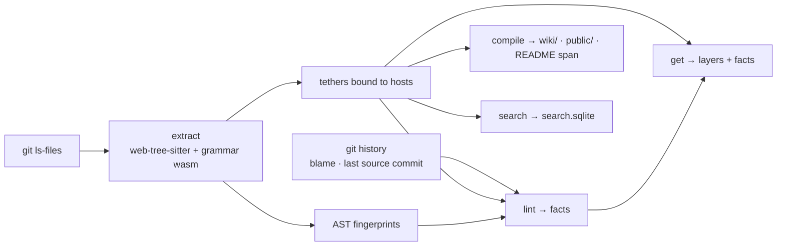

# tether

tether keeps each code explanation on the code it explains, and tells you when the code has changed under it.

`npm install -g @skastr0/tether` · [npm](https://www.npmjs.com/package/@skastr0/tether) · v0.2.1 · macOS and Linux

## The pain

Your agent reads the docs before it reads the code.

- **The doc is stale, and the agent trusts it.** `docs/architecture.md` was right a month ago. The agent answers from it anyway.
- **You spend the session correcting it.** You type "ignore the docs, read the code", and the agent rebuilds what the doc was meant to save.
- **Nothing tells you which notes went stale.** A doc that lives apart from the code can drift for weeks, and nobody notices.

## What tether does

```text
$ tether lint '{"root":"."}'
{ "facts": [
    { "kind": "rogue_document",           "path": "docs/architecture.md" },
    { "kind": "host_fingerprint_changed", "path": "src/session.ts" } ],
  "failed": true }
```

You write each explanation next to the code it explains. tether ties it to that code through git and the syntax tree. When the code changes and the explanation doesn't, `tether lint` reports it, and committing the code doesn't clear the report. Before an agent edits, `tether get` gives it every explanation that applies, with those reports attached.

| where you write it | what it explains |
|---|---|
| a `@tether` comment directly above a declaration | that function, type, or method |
| `foo.ts.tether` beside `foo.ts` | that file |
| `src.tether` beside `src/` | that folder |
| `root.tether` at the repo root | the whole repo |

| tether is | tether is not |
|---|---|
| explanations kept in the repo, on the code they explain | a docs site or wiki you keep in sync by hand |
| a report of where code changed under its explanation | a check that the explanation is true |
| a JSON CLI that any agent or CI job can call | API reference (types and signatures stay in the code) |
| what is true of the code now | session memory |

**Status:** usable, with the gaps listed [below](#limits). v0.2.1 on macOS and Linux (glibc), arm64 and x64. Windows and Alpine are not supported.

## Install and first run

You need Node 22.14+ and Git. The npm package installs a native binary for your platform, so you don't need Bun.

1. Install.

   ```sh
   npm install -g @skastr0/tether
   ```

2. Check it inside your repo.

   ```text
   $ tether doctor '{"root":"."}'
   "status": "ok"   (git.repository, grammars.wasm, home.writable, discovery.schema, discovery.examples)
   ```

3. Write an explanation directly above a function, then commit it.

   ```ts
   /** @tether
    * Refresh writes a new session row, then deletes the old one.
    * Never update the row in place: the old token must keep working
    * until the new one is saved.
    */
   export function refreshSession(id: string, token: string) {
     return { id, token, rotatedAt: Date.now() }
   }
   ```

4. Lint.

   ```text
   $ tether lint '{"root":"."}'
   { "facts": [], "failed": false }
   ```

## Use

### When the code changes under an explanation

Someone changes `refreshSession` to update the row in place, adds `docs/architecture.md`, and commits both. The explanation above the function is now wrong.

```text
$ tether lint '{"root":"."}'
{ "facts": [
    { "kind": "rogue_document",           "path": "docs/architecture.md" },
    { "kind": "host_fingerprint_changed", "path": "src/session.ts" } ],
  "failed": true,
  "comparisons": [ { "path": "src/session.ts", "check": "host_fingerprint",
      "baseline": { "commit": "1bfe926…", "method": "inline_blame" },
      "before": "typescript@14:…17545af42bad",
      "after":  "typescript@14:…6ff8a89" }, … ] }
exit 1
```

- `host_fingerprint_changed`: the function changed after its explanation was last edited. The baseline is the commit where the explanation last changed, so the report stays after the code is committed.
- `rogue_document`: a tracked `.md` or `.txt` file that isn't on the [allowlist](#configuration). It fails lint.

Update the explanation to match the code, commit, and lint is clean again:

```text
$ tether lint '{"root":"."}'
{ "facts": [], "failed": false }
exit 0
```

### What an agent reads before it edits

```text
$ tether get '{"root":".","path":"src/session.ts","symbol":"refreshSession","context":true}'
{ "layers": [
    { "host": { "kind": "symbol", "path": "src/session.ts", "name": "refreshSession" },
      "tethers": [ { "doc": "Refresh writes a new session row, then deletes the old one. …" } ] } ],
  "facts": [ { "kind": "host_fingerprint_changed", "path": "src/session.ts" } ],
  … }
```

With `context:true`, the explanations on the symbol, its file, each enclosing folder, and the repo come back as separate layers. The facts show which of them the code has moved under.

### Search explanations

`search` reads the index that `extract` writes, so run `extract` first.

```text
$ tether extract '{"root":"."}'   # prints the extracted explanations as JSON
$ tether search '{"root":".","query":"old token"}'
{ "mode": "fusion",
  "hits": [ { "path": "src/session.ts",
      "host": { "kind": "symbol", "name": "refreshSession" },
      "snippet": "…the [old] [token] must keep working\nuntil the new one is saved." } ] }
```

Search is lexical (SQLite FTS5) by default. With `SYNTHETIC_API_KEY` set, it adds semantic ranking through Synthetic's embedding API, which sends the indexed text to that service.

## How it works



`extract` parses every git-tracked file and binds each `@tether` comment to the declaration directly below it. Each host gets a fingerprint of its syntax tree: reformatting leaves it unchanged, while renaming it or changing its code changes it. A folder's fingerprint covers every tracked file under it, so any edit in `src/` shows up on `src.tether`. `lint` finds the commit where each explanation last changed and compares the fingerprint then with the fingerprint now. Everything tether generates goes under `~/.config/tether/projects/<repo>/` (or `$TETHER_HOME`). The one exception is the marked region in `README.md` that `compile` rewrites.

Languages: TypeScript, TSX, JavaScript, Rust, Go, Ruby, Python.

## Facts

`lint` reports a fixed set of ten facts. By default, seven fail lint (exit 1) and three are reported only.

| fact | when | fails by default |
|---|---|---|
| `rogue_document` | a tracked `.md`/`.txt` file that isn't allowlisted | yes |
| `ill_formed` | a parse error, a `@symbol` that doesn't match the declaration below it, or a `../` path | yes |
| `host_missing` | the file, folder, or declaration an explanation sits on is gone | yes |
| `symbol_missing` | `@symbol` names a declaration that isn't in the file | yes |
| `symbol_ambiguous` | `@symbol` matches more than one declaration in the file | yes |
| `ref_missing` | an optional `@ref` target is gone | yes |
| `public_surface_stale` | the generated region in `README.md` doesn't match `tether compile` | yes |
| `host_fingerprint_changed` | the code changed after its explanation last changed | no |
| `ref_fingerprint_changed` | a `@ref` target changed after the explanation last changed | no |
| `duplicate_id` | two explanations claim the same symbol in one file | no |

## Configuration

`.tether.json` at the repo root is optional.

```json
{
  "allowlist": ["docs/runbook.md"],
  "fail_on": ["rogue_document", "ill_formed", "host_missing", "symbol_missing",
              "symbol_ambiguous", "ref_missing", "public_surface_stale",
              "host_fingerprint_changed"]
}
```

- `allowlist` adds full paths that may exist as standalone `.md`/`.txt` files. These are allowed without config: `README.md`, `LICENSE.md`, `SECURITY.md`, `CONTRIBUTING.md`, `CODE_OF_CONDUCT.md`, `SUPPORT.md`, `CHANGELOG.md`, `AUTHORS.md`, and `NOTICE.md` at the repo root; `AGENTS.md`, `CLAUDE.md`, and skill folders anywhere; empty files; and test fixture folders.
- `fail_on` replaces the default list. The example above keeps the defaults and also fails when code changes under an explanation.

## Commands

Every command takes one JSON argument and prints one JSON envelope. `tether capabilities`, `tether schema show <command>`, and `tether examples show <command>` describe each one.

| command | what it does |
|---|---|
| `doctor` | checks git, grammar wasm, the home directory, and discovery |
| `extract` | reads explanations from tracked files and caches them for `search` |
| `lint` | reports facts; exits 1 when a `fail_on` fact is present |
| `get` | returns the explanations for a path or symbol, with live facts |
| `list` | lists explanations by path prefix, host kind, symbol, or `@public` |
| `facts` | returns the fact list |
| `aggregate` | counts explanations or facts by host kind, folder, or fact kind |
| `search` | searches the index from `extract` |
| `compile` | writes a wiki of every explanation, plus a public tree and README region for `@public` ones |

## Using it with agents

[`skills/tether/SKILL.md`](skills/tether/SKILL.md) teaches an agent to read explanations before editing and to write new ones. Copy it into your harness's skills folder (for Claude Code, `.claude/skills/tether/`). To fail CI on stale explanations, run `tether lint '{"root":"."}'` as a step.

## Where it fits

When several agents work in one codebase, tether holds the notes one agent leaves on the code for the next, and says when a note has gone stale. It pairs with [quasar](https://github.com/skastr0/quasar), which searches past agent sessions. More at [castro.engineer/projects/tether](https://castro.engineer/projects/tether).

## Limits

- Lint reports structure only. It can't tell whether an explanation is true, and editing an explanation clears its report whether or not anyone read the code.
- Code changing under an explanation doesn't fail lint unless you add it to `fail_on`.
- A folder explanation is flagged on every change under that folder.
- There is no `init` command yet. You write the first explanation by hand.
- Swift, Elixir, C++, Windows, and Alpine are not supported.

## Reference

- [`root.tether`](root.tether): the full language, host rules, and fact definitions. tether documents itself with tether.
- [`skills/tether/SKILL.md`](skills/tether/SKILL.md): the agent skill.

## Development

Requires Bun 1.3.14.

```sh
bun install --frozen-lockfile
bun run verify   # typecheck, tests, release checks
```

## License

MIT. See [LICENSE](LICENSE) and [NOTICE.md](NOTICE.md).

## Public explanations

This region is generated by `tether compile` from this repo's `@public` explanations.

`README.md` is allowlisted and may mix authored prose with one generated region (`<!-- tether:public -->` … `<!-- /tether:public -->`). Compile rewrites only that span: headings and nav from `@public` tethers. Doctrine source stays in the tethers.

Independent tracked markdown is illegal except an allowlist (README, LICENSE, SECURITY, …) and honorary `AGENTS.md` / `CLAUDE.md`, which are folder-scoped pre-steer files that should point at tether rather than describe the project.

## Not this

- Not JSDoc, rustdoc, or API reference. Types and signatures stay in the type system.
- Not session memory. That is a different corpus.
- Not a spec-keeper that asks you to manually bind `docs/auth.md` to files. Manual binds are optional extras. Forgetting them cannot hide a tether.

## This repo

Tether is built with tether. Project doctrine lives in `root.tether` (the language spec) and in collocated `.tether` files / comments. Honorary `AGENTS.md` only steers agents toward those surfaces.

See `root.tether` for the full language and fact taxonomy. See `skills/tether/SKILL.md` for how agents should document a project.

<!-- tether:public -->

# Public

- [.](#section)

## .

This file is the repo host (`root.tether`). It describes tether itself.
<!-- /tether:public -->
